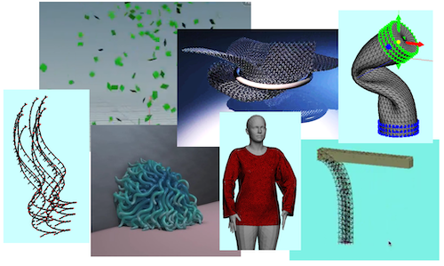

# Physics-based Animation (物理ベースアニメーション)

ITC-LMS (for Slack and GitHub Classroom invitaitons): 

- https://itc-lms.ecc.u-tokyo.ac.jp/lms/course?idnumber=20214860-10810F01

## Instructor

Dr. Nobuyuki Umetani 
- email: umetani@ci.i.u-tokyo.ac.jp
- url: http://www.nobuyuki-umetani.com/
- lab's website: https://cgenglab.github.io/labpage/en/

## Time

Monday 3rd period, 13:00pm - 14:30pm

## Course Description

Computer-generated images are everywhere in movies, video games, and VR. This course is an introduction to the techniques to animate objects in computer graphics based on the law of physics. The aim of the course is to get familiar with applied mathematics such as linear algebra, vector analysis, partial differential equations, variational principle, optimization, and numerical analysis through the animation techniques for particle systems, rigid bodies, elastic bodies. There are C++ programming assignments to acquire research-oriented graphics programming skills. 

Topics:
- mass-spring simulation
- rigid body simulation
- elastic body simulation
- cloth and hair modeling & simulation
- collision-detection using spatial hashing
- finite boundary method

## Lecture Schedule

| Day | Topic | Assignment | Scribble | Slide |
|:----|:---|:---|:---|-----|
| (1)  Apr. 5 | **Introduction** data structure for simulation Implicit surface |  | | [[1]](http://www.nobuyuki-umetani.com/scribble/introduction.pdf), [[2]](http://www.nobuyuki-umetani.com/scribble/data_structure.pdf) |
| (2)  Apr. 19 | **Time Integration**  Newtonian-mechanics  backward & forward Euler method,  particle system | [task0](task0) deadline: Apr.22th|  | [[2]](http://www.nobuyuki-umetani.com/scribble/data_structure.pdf), [[3]](http://www.nobuyuki-umetani.com/scribble/time_integration.pdf), [[4]](http://www.nobuyuki-umetani.com/scribble/grid_mesh_interpolation.pdf) |
| (3)  Apr. 26 | **Collision Detection**  bounding volume hierarchy,  Kd-tree, N-tree | [task1](task1) | | [[5]](http://www.nobuyuki-umetani.com/scribble/collision_detection_broad.pdf) |
| (4)  Mar. 10 | **Simple Deformation Energy**  mass-spring system,  Eulear-Lagrange equation,  Lagrangian mechanics | [task3](task3)  [task4](task4) | | [[6]](http://www.nobuyuki-umetani.com/scribble/mass_spring_system.pdf) |
| (5)  Mar. 17 | **Numerical Optimization**  Newton-Raphson method,  Levenberg–Marquardt method | [task2](task2) | |  |
| (6)  Mar. 24 | **Solving Large Linear System**  sparse matrix data structure,  conjugate gradient method | [task5](task5) | [[1]](http://www.nobuyuki-umetani.com/scribble/linsol_cg.pdf), [[2]](http://www.nobuyuki-umetani.com/scribble/linsol_cgprecond.pdf), [[3]](http://www.nobuyuki-umetani.com/scribble/linsol_ludecomp.pdf) | [[8]](http://www.nobuyuki-umetani.com/scribble/matrix_solver.pdf) |
| (7)  Mar. 31 | **Optimization with Constraint**  Lagrange multiplier method | [task6](task6) | | [[9]](http://www.nobuyuki-umetani.com/scribble/optimization_with_constraints.pdf) |
| (8)  Jun. 7  | **Rigid Body Dynamics** inertia tensor,  angular velocity | [task7](task7) | [[1]](http://www.nobuyuki-umetani.com/scribble/mech_rotation.pdf), [[2]](http://www.nobuyuki-umetani.com/scribble/mech_rigidbody.pdf) | [[10]](http://www.nobuyuki-umetani.com/scribble/rigid_body_dynamics.pdf) |
| (9)  Jun. 14 | **Collision and Friction** Coulomb friction,  impulse based method | ~~task8~~ | | [[11]](http://www.nobuyuki-umetani.com/scribble/collision_detection_narrow.pdf) |
| (10)  Jun. 21 | **Continuum Mechanics**  tensor, stress and strain | ~~task9~~ | [[1]](http://www.nobuyuki-umetani.com/scribble/mech_fluidcontinuum.pdf), [[2]](http://www.nobuyuki-umetani.com/scribble/mech_fluidgoverning.pdf) | [[12]](http://www.nobuyuki-umetani.com/scribble/tensor.pdf) |
| (11)  Jun. 28 | **Continuum Mechanics2**  finite elemenet method | [task10](task10) | [[1]](http://www.nobuyuki-umetani.com/scribble/fem_outline.pdf), [[2]](http://www.nobuyuki-umetani.com/scribble/fem_linearsolid.pdf), [[3]](http://www.nobuyuki-umetani.com/scribble/fem_mitc3.pdf) |  |
| (12)  Jul. 5  | **Non-physical Deformation**  singular value decomposition,  shape matching method,  linear blend skinning,  as-rigid-as possible deformation | [task11](task11) | |  |
| (13)  Jul. 12 | **Boundary Element Method**  Green’s functions,  thin-plate spline interpolation,  radial based function | [task12](task12) | [[1]](http://www.nobuyuki-umetani.com/scribble/bem_laplace.pdf), [[2]](http://www.nobuyuki-umetani.com/scribble/bem_helmholtz.pdf) |  |

## Grading

- 20% lecture attendance
  - Counted by asking question, and making comments ...etc
  - Maximum 1 count for 1 lecture, 5 counts for entire course
  - Starting from the second lecture
  - Tell the instructor your student ID & name if asked
  - The students who don't want to speak in English can write the question in English in the ZOOM chat (the instructor may pick it up and ask the ID & name)
- 80% small assignemnts
  - see below

## Assignemnts

There are many small programming assignments. To do the assignments, you need to create your own copy of this repository through **GitHub Classroom**.  These assignements needs to be submitted using **pull request** functionality of the GitHub. Look at the following document. 

[How to Submit the Assignments](doc/submit.md)

### Policy

- Do the assignment by yourself. Don't share the assignments with others.

- Don't post the answers of the assignment on Slack 

- Late submission of an assignment is subject to grade deduction

- Score each assignemnt will not be open soon (instructer needs to adjust weight of the score later)

### Tasks

- [task0](task0):  Make C++ Program with CMake
- [task1](task1): Particle System
- [task2](task2): Optimization
- [task3](task3): Deformation Using Optimization
- [task4](task4) : Bounding Volume Hierachy
- [task5](task5): Solving Large Linear System
- [task6](task6): Optimization with Constraints
- [task7](task7): Princepal Axes of 3D Shape
- [task8](task8): Deformation Gradient Tensor
- [task9](task9): Shape Matching Method
- [task10](task10): Thin Spline Deformation

## Slides

- [[1] introduction](http://www.nobuyuki-umetani.com/scribble/introduction.pdf)
- [[2] data_structure](http://www.nobuyuki-umetani.com/scribble/data_structure.pdf)
- [[3] time_integration](http://www.nobuyuki-umetani.com/scribble/time_integration.pdf)
- [[4] grid_mesh_interpolation](http://www.nobuyuki-umetani.com/scribble/grid_mesh_interpolation.pdf)

- [[5] collision_detection_broad](http://www.nobuyuki-umetani.com/scribble/collision_detection_broad.pdf)
- [[6] mass_spring_system](http://www.nobuyuki-umetani.com/scribble/mass_spring_system.pdf)
- [[8] matrix_solver](http://www.nobuyuki-umetani.com/scribble/matrix_solver.pdf)
- [[9] optimization with constraints](http://www.nobuyuki-umetani.com/scribble/optimization_with_constraints.pdf)
- [[10] rigid_body_dynamics](http://www.nobuyuki-umetani.com/scribble/rigid_body_dynamics.pdf)
- [[11] collision_detectoin_narrow](http://www.nobuyuki-umetani.com/scribble/collision_detection_narrow.pdf)
- [[12] tensor](http://www.nobuyuki-umetani.com/scribble/tensor.pdf)

## Reading Material

- [Physically Based Modeling: Principles and Practice, Siggraph '97 Course notes by Dr. Baraff](http://www.cs.cmu.edu/~baraff/sigcourse/index.html)

- [Physics-Based Animation  by Kenny Erleben et al. (free textobook about rigid body dynamics)](https://iphys.wordpress.com/2020/01/12/free-textbook-physics-based-animation/)

- [Awesome Computer Graphics (GitHub)](https://github.com/luisnts/awesome-computer-graphics)

  

