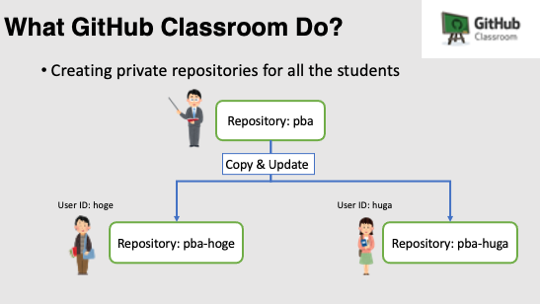
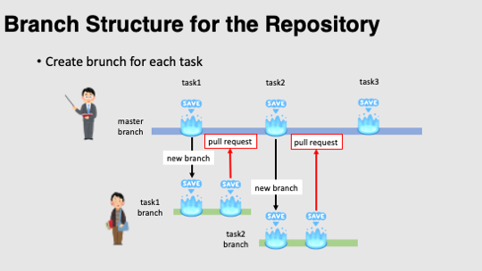

# How to Submit the Assignment 

There are many small programming assignments. These assignements needs to be submitted using **pull request** functionality of the GitHub. 


## Making Your Repository using GitHub Classroom



The assignments need to be submitted using "pullrequest" functionality of the GitHub. Using the system called "GitHub Classroom", each student makes his/her own private repository that is a copy of "https://github.com/PBA-2021S/pba". If a student has a GitHub account named `<username>`, the name of the repository will be `pba-<username>`. The private repository is only visible from the student and the instructor. In the second class, It will be shown how to make your own class repository using GitHub classroom. 


## Overview



Let's assume you are looking at the repository `pba-<username>` (e.g., pba-nobuyuki83) and the  `task<task number>` is the assignment (e.g., task2). The submission is made by

1. create a branch of the name `task<task number>`

2. follow the instruction written in `\pba-<username>/task<task number>/README.md`

3. push the repository with the branch `task<task number>`

4. make a pull request on GitHub page

5. Instructor will close the pull request after grading. 

   

## Setup C++ Programming Environment

First of all, you need to setup C++ Probramming environment (git, cmake, c++ compilar)

- [How to Set Up C++ Programming Environment](../doc/setup_env.md)


## Download the Repository

If you don't have the local repository in your computer, clone it from the remote repository

```bash
$ git clone https://github.com/PBA-2021S/pba-<username>.git
```

**Before doing each assignment**, Sync the local repository to the remote repository.

```bash
$ cd pba-<username>   # go to the local repository
$ git checkout main   # set main branch as the current branch
$ git fetch origin main   # download the main branch from remote repository
$ git reset --hard origin/main   # reset the local main branch same as remote repository
```


## Setup Libraries

For all the assignement, we use GLFW Library for OpenGL visualization. Please take a look at the following document

- [How to Set Up GLFW Library](../doc/setup_glfw.md)

Some assignement use [Eigen](https://eigen.tuxfamily.org/index.php?title=Main_Page) library for matrix operation. Please follow the following document for setting up.    

- [How to set up the Eigen Library](../doc/setup_eigen.md)  

Additionally, for some assignements, [DelFEM2](https://github.com/nobuyuki83/delfem2) needs to be installed in `pba-<username>/3rd_party` . DelFEM2 is a collection of useful C++ codes written by the instructer. Please install and updte this library with the following command.

```bash
$ cd pba-<username> # go to the top of local repository
$ git submodule update --init 3rd_party/delfem2
```


## Make Branch for Each Assignment

Create the `task<number>` branch and set it as the current branch. For `task1` the commands look like

```bash
$ git branch task1    # create task1 branch
$ git checkout task1  # switch into the task1 branch
$ git branch -a       # make sure you are in the task1 branch
```

Now, you are ready to edit the code and do the assignment!


## Do the Assignment

 Edit the code and this mark down document.


## Upload the Change

After you finish editing, you submit the updates pushing to the `task<number>` branch of the remote repository. For `task1` the command look like

```bash
cd pba-<username>    # go to the top of the repository
git branch -a  #  make sure again you are in the task1 branch
git status  # check the changes (typically few files are shown to be "updated")
git add .   # stage the changes
git status  # check the staged changes (typically few files re shown to be "staged")
git commit -m "task1 finished"   # the comment can be anything
git push --set-upstream origin task1  # update the task1 branch of the remote repository
```


## Make a Pull Request

Go to the GitHub webpage `https://github.com/PBA-2021S/pba-<username>` . If everything looks good on this page, make a pull request. 


## Trouble Shooting

- I mistakenly submit the assignement in the `main` branch
  - Make a branch `task<number>` and submit again
- Many library files are shown when I type `git status` 
  - add `pba-<username>/.gitignore` the directory/files need to be ignored

