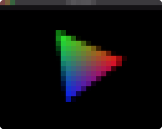
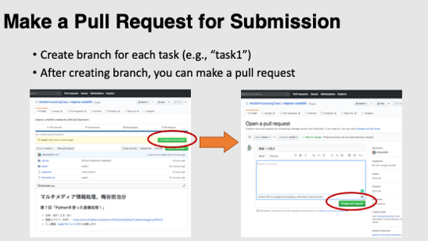

**this assignment is currently under development**


----

# Task0: Build C++ Program with CMake



Follow the instruction below to build the attached C++ code. This code will display an OpenGL window showing a triangle.  Take a screenshot of the window (looks like the image above) and paste it below.  

=== (paste the screenshot image here`` ) === 

----


## Instruction 

### Set Up Programming Environment 

You need to have **git**, **cmake**, and **C++ compiler** in your computer to complete this assignement. Read the following document to install these. 

[How to Set Up C++ Programming Environment](../doc/setup_env.md)


### Go to Local Repository

if you don't have the local repository, clone it from the remote repository

```bash
$ git clone https://github.com/PBA-2021S/pba-<username>.git
```

Go to the top of the local repository

```bash
$ cd pba-<username>     # go to the local repository
```


### Update Local Repository

Please updat the local repository on your computer

```bash
$ git checkout master   # set master branch as the current branch
$ git fetch origin master    # download the master branch from remote repository
$ git reset --hard origin/master  # reset the local master branch same as remote repository
```


### Set Up GLFW Library

`GLFW` library is necessary to compile the code. Read the following document to set up the library under `pba-<username>/3rd_party/`

[How to Set Up GLFW Library](../doc/setup_glfw.md)


### Creating a Branch

To do this assignement, you need to be in the branch `task0`.  You can always check your the current branch by

```bash
$ git branch -a   # list all branches, showing the current branch 
```

You are probably in the `master` branch. Let's create the `task0` branch and set it as the current branch.

```bash
$ git branch task0   # create task0 branch
$ git checkout task0  # switch into the task0 branch
$ git branch -a   # make sure you are in the task0 branch
```


### Compile the Code and Edit This Document

After the environment is ready, let's build and compile the code. We do **out-of-source** build by making a new directory for build `task0/build` and compile inside that directory
```bash
$ cd task0
$ mkdir build
$ cd build
$ cmake .. 
$ cmake --build .
```
Update this markdown document by editing `pba-<username>/task0/README.md` .Please learn the syntax of the markdown document by yourself.


### Submit

Finally, you submit the document by pushing to the `task0` branch of the remote repository. 

```bash
cd pba-<username>    # go to the top of the repository
git status  # check the changes
git add .   # stage the changes
git status  # check the staged changes
git commit -m "task0 finished"   # the comment can be anything
git push --set-upstream origin task0  # up date the task0 branch of the remote repository  
```

got to the GitHub webpage `https://github.com/PBA-2021S/pba-<username>` . If everything looks good on this page, make a pull request. 




----


## Trouble Shooting

- I mistakenly submit the assignement in the `master` branch
  - Make a branch `task0` and submit again


