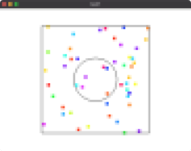

# Task1: Particle System

**deadline: April 29th (Thu) at 15:00pm**




## Setting Up

Pleae look at the following document for environment setup, creating branch, and making pull request.

[How to Submit the Assignment](../doc/submit.md)

- make sure you synchronized the `main ` branch of your local repository  to that of remote repository.
- make sure you created branc h `task1` from `main` branch. 
- make sure you are currently in the `task1` branch (use `git branch -a` command).
  

Additionally, you need the library [DelFEM2](https://github.com/nobuyuki83/delfem2) in `pba-<username>/3rd_party` 

```bash
$ cd pba-<username> # go to the top of local repository
$ git submodule update --init 3rd_party/delfem2
```

(DelFEM2 is a collection of useful C++ codes written by the instructer).


## Problem1

1. Build the code using cmake 
2. Run the code
3. Take a screenshot image (looks like image at the top)
4. Paste the screenshot image below

   

=== Paste the screen shot here`` ===


## Problem 2

Modify `main.cpp` to collide points with the circular obstacle in the middle (see around 92th line of the code). Just 4 or 5 lines of codes need to be modifiled. We assume that the **coefficient of restitution** is one.


=== Paste the screen shot here``  ===


