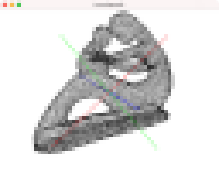
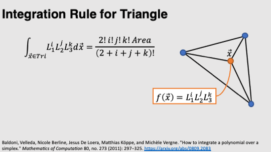
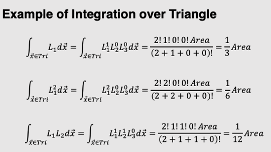
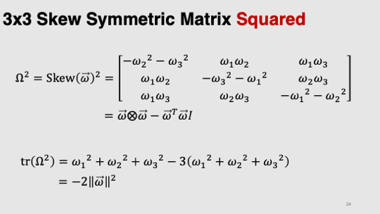

# Task11: Inertia Tensor

**Deadline: July 1st (Thursday) at 15:00pm**



## Setting Up

Please look at the following document for environment setup, creating branch, and making pull request.

- [How to Submit the Assignment](../doc/submit.md)

In this assignment, it is necessary to install [Eigen](https://eigen.tuxfamily.org/index.php?title=Main_Page) library. Please follow the following document for setting up.    

- [How to set up the Eigen Library](../doc/setup_eigen.md)  

Additionally, the library [DelFEM2](https://github.com/nobuyuki83/delfem2) must be in `pba-<username>/3rd_party`.  
Type following commands to install and update the library.

```bash
$ cd pba-<username> # go to the top of local repository
$ git submodule update --init 3rd_party/delfem2
```

(DelFEM2 is a collection of useful C++ codes written by the instructor.)


## 3D View control

- Alt + Left mouse drag = rotation
- Shift + Left mouse drag = translation 
- Mouse wheel = zoom in/out
  


## Problem1

Build the program using `cmake`. 
Run the program and take a screenshot image of the window. Paste the screenshot image below by editing this mark down document:

=== paste screenshot here ===


## Problem 2

Edit `main.cpp` to compute the 3x3 inertia tensor of a 3D mesh. 
Note that the mass is distributed only on the surface of the mesh (i.e., the shape is hollow inside the mesh).
The areal mass density of the surface is one. 

Compute the rotation around the origin of the coordinate. 
The mesh is already translated such that the center of the mass is located at the origin.
The line in red, blue and green is be the principal axis of hte inertia tensor.

Write down the eigenvalues of the inertia tensor below (they will be shown in the standard output):
- 1st eigenvalue: 
- 2nd eigenvalue: 
- 3rd eigenvalue: 


Paste the screenshot image below:

=== paste screenshot here ===


The following slides may be useful:









