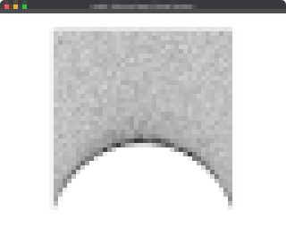
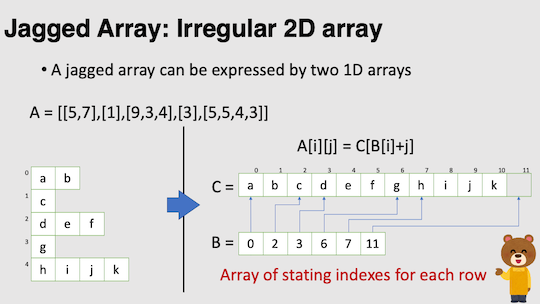
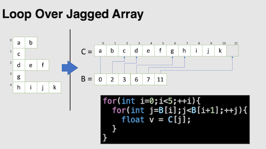

# Task5: Solving Large Linear System 

- Gauss-Seidel Relaxation for unstructured mesh
- **Deadline: June 3rd (Thursday) at 15:00**



## Setting Up

Pleae look at the following document for environment setup, creating branch, and making pull request.

[How to Submit the Assignment](../doc/submit.md)

Additionally, you need the library [DelFEM2](https://github.com/nobuyuki83/delfem2) installed and updated in `pba-<username>/3rd_party` 

```bash
$ cd pba-<username> # go to the top of local repository
$ git submodule update --init 3rd_party/delfem2
```

(DelFEM2 is a collection of useful C++ codes written by the instructer).


## Problem1

Build the `main.cpp` using `cmake`. Run the program and take a screenshot image of the window. You will probably see some **highly distorted** mesh and that's OK. Paste the screenshot image below by editing this mark down document:

=== paste screenshot here ===


## Problem 2

Consider each edge of the mesh is a spring with zero rest length. In other words the spring's elastic potential energy is `E_i=1/2l_i^2`,  where `l_i` is the distance between two end points of `i`-th spring. Write a program to minimize the sum of elastic potential energy `E=∑E_i`.

The optimization has to be done using the **Gauss-Seidel(GS) method**. The GS method updates the coordinate of the point one-by-one. Let us denote  `ip` is the point to be moved, and `jp` is the point surrounding `ip`.  For each updates of GS method, the coordinate of `ip` is optimized and coordinates for `jp` is fixed. Use the fact the sum of squared distance between `ip` and `jp` is minimized  when the `ip` is moved to the **gravity center** of `jp`.

The `jp` that is one-ring neighbourhood of `ip` is stored inside `Psup_Ind` and `Psup` in the format of **jagged array**. See the slides below for the detail of the format. 






Write some code around line #31 in the `main.cpp`. **Once the implementation is successful, the energy should steadly decrease.** Paste the resulting screenshot image below. 

=== paste screenshot image here ===

  


----


