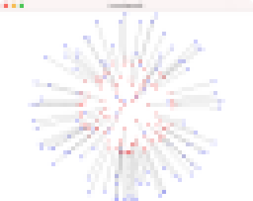

# Task7: Rotation 

- Optimization of rotation 
- **Deadline: June 17th (Thursday) at 15:00**




## Setting Up

Pleae look at the following document for environment setup, creating branch, and making pull request.

- [How to Submit the Assignment](../doc/submit.md)

In this assignment, it is necessary to install [Eigen](https://eigen.tuxfamily.org/index.php?title=Main_Page) library.  Please follow the following document for setting up.    

- [How to set up the Eigen Library](../doc/setup_eigen.md)  

Additionally, you need the library [DelFEM2](https://github.com/nobuyuki83/delfem2) installed and updated in `pba-<username>/3rd_party` 

```bash
$ cd pba-<username> # go to the top of local repository
$ git submodule update --init 3rd_party/delfem2
```

(DelFEM2 is a collection of useful C++ codes written by the instructer.)


## Problem1

Build the `main.cpp` using `cmake`. Run the program and take a screenshot image of the window.  Paste the screenshot image below by editing this mark down document:

=== paste screenshot here ===


## Problem 2

Optimize the rotation matrix `R` such that the sum of squared distances between the rotated source points and fixed target points are minimized. Use the Netwon's method for the energy minimization. Write some code around line #71 in the `main.cpp` to compute the gradient and hessian of the energy of one pair of source and target points. (The modifications are probably very little, just two lines of short codes). **Once the implementation is successful, the energy should steadly decrease.** 

Report the energy after convergence: 

- converged energy = ?????


Paste the resulting screenshot image below:

=== paste screenshot image here ===

  


----


