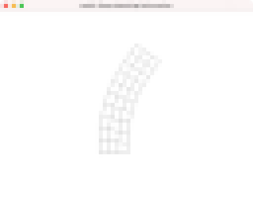
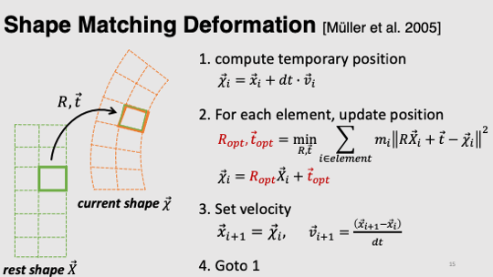
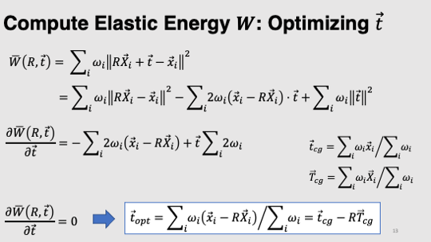
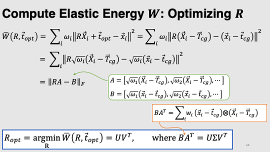

# Task9: Shape Matching Deformation

**Deadline: July 8th (Thursday) at 15:00pm**




## Setting Up

Please look at the following document for environment setup, creating branch, and making pull request.

- [How to Submit the Assignment](../doc/submit.md)

In this assignment, it is necessary to install [Eigen](https://eigen.tuxfamily.org/index.php?title=Main_Page) library. Please follow the following document for setting up.    

- [How to set up the Eigen Library](../doc/setup_eigen.md)  

Additionally, you need the library [DelFEM2](https://github.com/nobuyuki83/delfem2) in `pba-<username>/3rd_party` 

```bash
$ cd pba-<username> # go to the top of local repository
$ git submodule update --init 3rd_party/delfem2
```

(DelFEM2 is a collection of useful C++ codes written by the instructor.)


## Problem1

Compile the `main.cpp` using the `CMakeLists.txt`, run the program and take a screenshot image. 
Paste the image below.

=== paste screenshot here ===


## Problem 2

Edit `main.cpp` to implement the 2D shape matching deformation [1].
The rectangular shape is represented by a quad mesh, and the bottom part of the rectangle is shaken horizontally. 
In the shape matching deformation, we need to fit each quad in the rest shape into the corresponding quad in the tentative shape by optimal rigid transformation. 
The edits should be necessary only around line #123. 
Paste the screenshot image of the program once it is finished.

=== paste screenshot here ===


## Material 

The following slides may be useful







-  [JacobiSVD module in Eigen](https://eigen.tuxfamily.org/dox/classEigen_1_1JacobiSVD.html)

- [1] Matthias Müller, Bruno Heidelberger, Matthias Teschner, and Markus Gross. 2005. Meshless deformations based on shape matching. In ACM SIGGRAPH 2005 Papers (SIGGRAPH '05).


